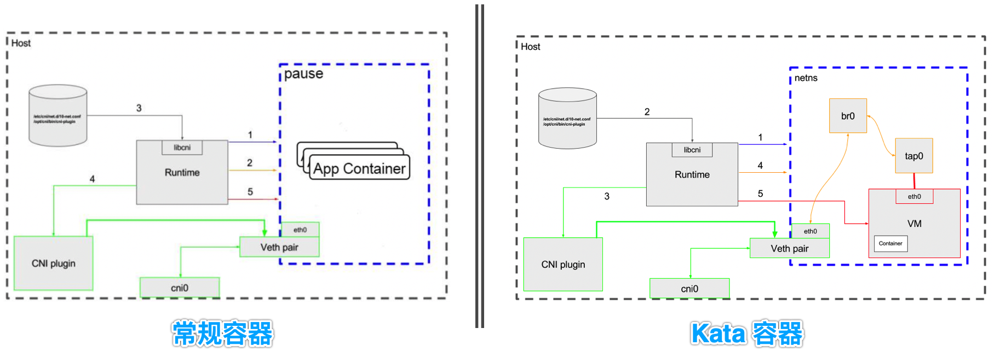
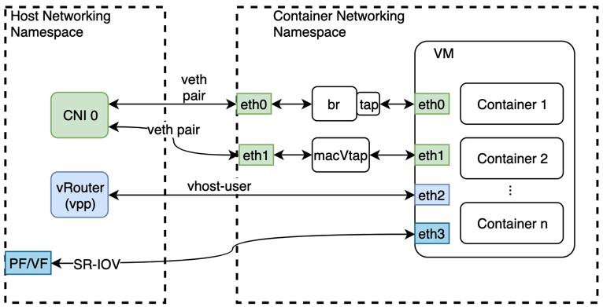
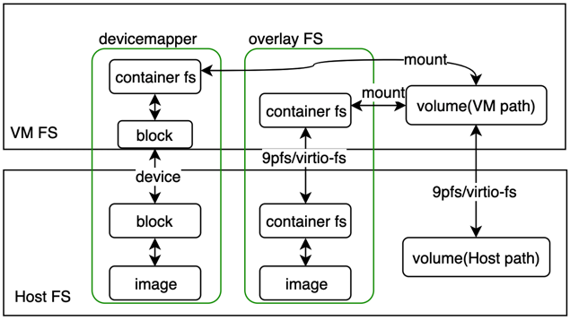
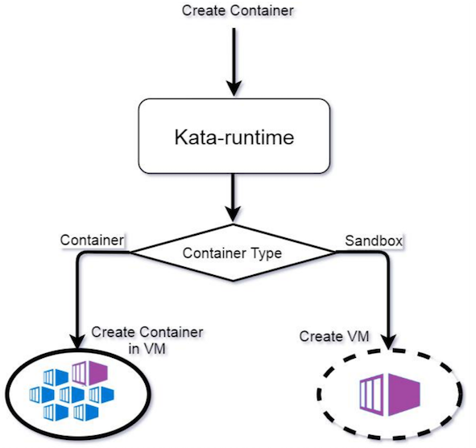
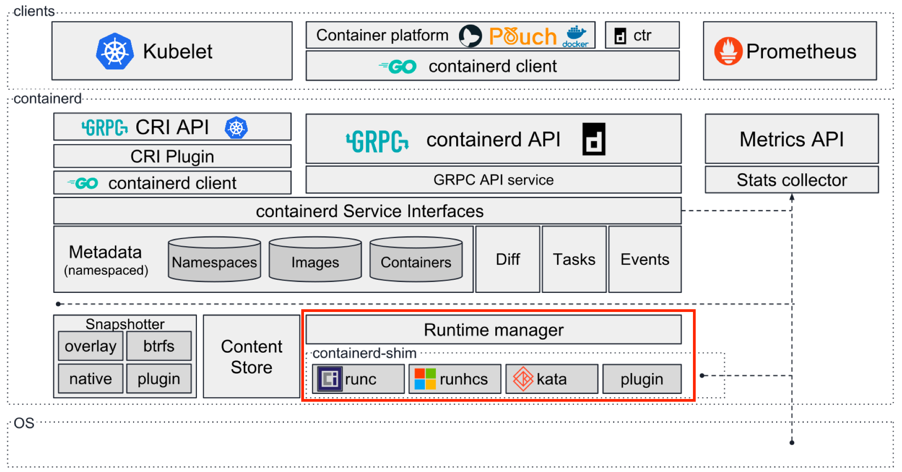
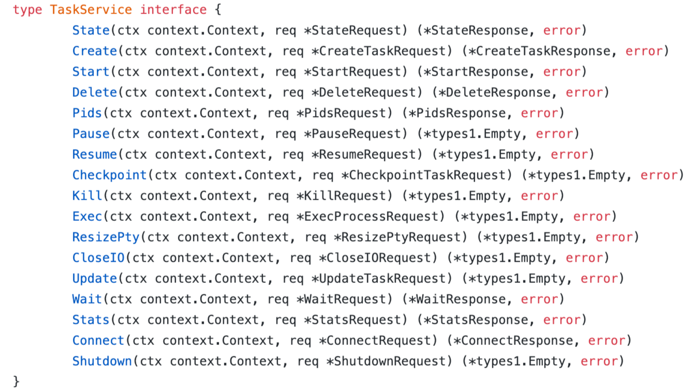
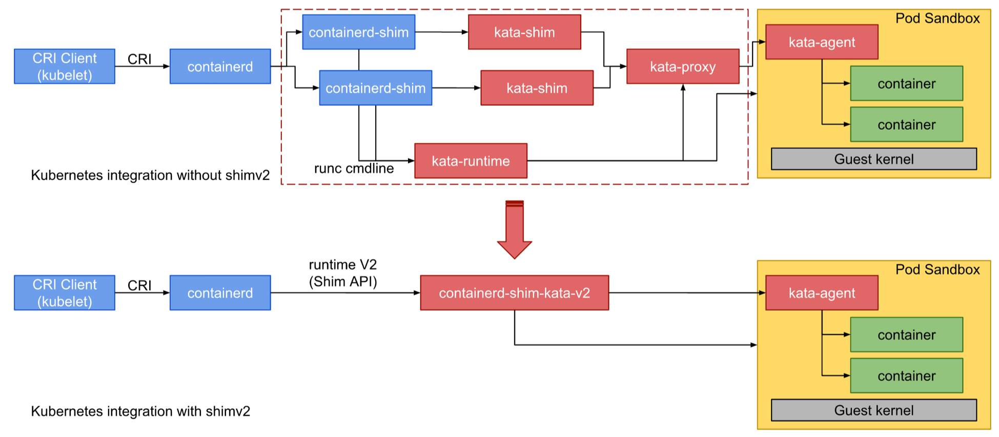

# Kata-containers技术分享

[TOC]

> 引言：本文主要让读者认识kata-containers是什么，并有针对性的介绍几个比较关键的模块。


## 1. 认识kata-containers

关于kata-containers的发展历史，在容器生态中的位置，以及组件架构，可以参考我的另一篇文章《[认识kata-containers](https://blog.csdn.net/O4dC8OjO7ZL6/article/details/78986732)》，在这里就不在赘述。需要注意的是，在功能演示阶段，使用的是kata-containers的前身—— `clear containers`（由于当时kata工程还没有可运行代码，即`clear contaienrs`和`runv`还未合并）

本文将主要介绍kata-containers中的几个主要技术点，以及使用场景。

## 2. kata-containers网络

既然kata容器相对于普通容器，隔了一层VM，对网络设备的分配，一定会有所差异。下图（图片来自GitHub）给出了传统容器和kata容器创建网路的对比（这里以k8s为pod分配网络为例）。


- 普通容器：
  流程相对比较简单，整个网络分配过程，不需要oci runtime的参与，只要将容器的Network Namespace 传给CNI插件，CNI插件将创建/分配的网络设备放在指定Network Namespace即可，最后以该Network Namespace为基础创建容器，如上图右侧所示；

- kata容器

  由于kata容器的VM层，相对于k8s、CRI Runtime以及CNI插件是透明的，即CNI插件不知道有VM的存在。因此为kata容器分配网络时，实际上前半部分跟普通容器一样，CRI runtime也会创建一个Network Namespace，并传给CNI插件。不同点在于，当CNI插件分配完网络后，kata需要做如下工作：
  1. 从监听Network Namespace，获取网络配置信息
  2. 建立通往VM的网络设备，如网桥、tap设备
  3. 用以创建的设备创建VM，并将网络配置信息（mac, ip, route等）传入VM中，创建相同配置的网卡设备，
  4. 在VM中创建容器


kata除了可以使用传统虚拟网卡，还支持其他类型的网卡分配，下图给出了常用的三种：



1. 常规虚拟网卡，前面介绍过其创建过程，这里画了两种对接VM的方式，一种是前文介绍的方式，即bridge+tap组合，还有一种是直接在原来虚拟网卡的基础上创建macVtap设备，跟VM对接，较前一种方式，在网络性能上略有提升（少了一个网络设备）。
2. 物理网卡，或者使用SR-IOV技术创建的VF网卡，这种方式需要CNI插件支持分配对应的网卡类型。当CNI插件将网络设备分配给Network Namespace时， kata会监听到该分配动作，从而获取到网卡的设备信息（PCI设备）和配置信息，并在创建VM的过程中，直接将该设备分配给VM（这时在host上就看不到该网络设备了）
3. vhost-user网络设备，工作在用户态的网络设备，主要用在NFV场景，通常会结合vpp、dpdk等技术使用，同时也需要CNI插件的支持。该设备的分配方式，跟其他类型的网卡有所区别，不是分配显式的网卡，而是将网络配置信息和一个sock文件放在kata预定好的目录下，由kata来监听该目录，最后创建VM的时候，将该sock设备分配给VM，并在VM内部创建对应的网卡设备，与Sock文件建立连接，并分配网络信息。由于这种网络设备是通过共享内存的方式通信，因此有很高的通信效率。但其使用场景主要是host和guest之间的通信。跨主机通信，需要借助dpdk技术。（*这里CNI插件需要知道kata的存在*）


## 3. kata-contaienrs存储
经过前面的介绍，肯定有人会问，kata容器和host之间隔了一层VM，是怎么使用镜像的，容器的文件系统是怎么传进去的呢？本节主要回答这个问题。

在介绍kat容器之前，需要先了解一下常规容器是怎么为容器准备文件系统并创建容器的（以containerd为例）。
1. 需要根据启动容器的配置，获取容器的镜像，在通过对应的文件系统驱动（overlayfs或devicemapper）获取镜像的每一层信息，为容器创建可写层，并生成mount配置（由containerd完成）；
2. 使用文件系统驱动的机制，将每一层按顺序叠加起来，mount到host上的一个挂载点，构建成文件系统（由containerd-shim完成）；
3. 用构建好的容器文件系统以及容器的配置信息在host上创建容器（由runc完成）。

对于kata容器，第一步跟常规容器类似。主要差异在后面的步骤。且对于不同的文件系统驱动，在kata中的处理流程也不同。分为两类devicemapper和其他（如overlay(2)、aufs等）

- devicemapper
由于该文件系统驱动将容器和镜像的每一层都做成有依赖关系的快照，最终的结果是一个block设备，因此，在kata内部，会将该设备直接传给VM，并在VM中将其挂载到目标挂载点，形成容器的文件系统，并在VM中创建容器，其中VM外部的操作由kata-runtime（shim v1）或 kata-contaienrs-shimv2(shim v2)完成，VM内部有kata-agent完成。

- 其他（如overlay(2)、aufs等）
对于非devicemapper的文件系统驱动，由于在host中，已经形成了文件系统，而非设备，因此只能通过某种方式，让VM可以访问host中的容器文件系统，并在VM中创建容器。在kata中，前期主要使用了9pfs技术，由于使用了类似远程访问，因此，容器对于文件系统的读写性能较差。在最近的版本中，增加了virtio-fs技术，来改善读写性能，然而该技术目前还没有加入Linux内核，需要用户手动安装。

除了容器文件系统本身，容器还可以配置volume，即可以将host上的某个目录挂载到容器中，供容器使用，这对于普通容器相对比较容器。
对于kata容器，由于voluem本身是host上的一个路径，因此也是常规文件系统，因此，也需要通过9pfs或virtio-fs技术，将该路径映射到VM中，再将其挂载的对应的容器文件系统。

下图给出了kata容器文件系统构建的简单示意图。


## 4. kata创建pod流程

细心的读者可能会注意到，前面的图中，一个kata VM中，有的包含了两个容器。实际上，k8s在创建基于kata-containers的pod时，也是一个pod对应一个kata VM。这里就有一个问题，k8s如何控制kata，让一个kata VM中创建多个容器呢？

原来kata-containers在设计之初就天然兼容了k8s，其将容器分为两种类型——Sandbox和Container。当容器类型为`Sandbox`时，kata会首先为改容器单独创建一个kata VM，并在该VM中在创建容器，而如果容器类型为`Container`时，则kata会从容器的配置信息中，找到该容器归属于那个`Sandbox`，然后将该容器创建在sandbox对应的kata VM中。

那么问题又来了，kata中所需要的这些信息，从哪里获取呢？

首先，我们需要知道，kata-containers本身是OCI runtime，即符合OCI规范。而OCI规范容器配置文件中，哪些字段可以传递用户自定义的字段呢——`env`，`annotations`。`env`通常情况下，主要是传输业务相关的数据，即供容器应用本身使用，而`annotations`可以传递控制相关信息。

其次，k8s中的pod的定义，就提供了annotations字段，而该字段最终，也会传给OCI规范定义的同名字段（*runtime为docker时除外，由于docker在功能实现中，没有将该信息传递给OCI runtime*）。


基于上述两中机制，kata就可以通过`annotations`字段来获取k8s传来容器类型和关系，下面以Containerd为例，看看annotations字段的定义：
```go
	// ContainerTypeSandbox represents a pod sandbox container
	ContainerTypeSandbox = "sandbox"

	// ContainerTypeContainer represents a container running within a pod
	ContainerTypeContainer = "container"

	// ContainerType is the container type (sandbox or container) annotation
	ContainerType = "io.kubernetes.cri.container-type"

	// SandboxID is the sandbox ID annotation
	SandboxID = "io.kubernetes.cri.sandbox-id"
```
> `ContainerType` 定义了annotations中的容器类型的key；
> `ContainerTypeSandbox` 和 `ContainerTypeContainer`分别定义了两种容器类型的volue；
> `Sandbox` 定义了annotations中，sandbox ID的key，信息，主要用来维护containers的归属关系。


下图给出了kata根据容器类型，创建容器的简单流程。


## 5. kata的架构调整——Shim-v2
kata在v1.5.0版本开始，基于containerd的集成，对其架构做了调整，即将其多个组件（`kata-shim`，`kata-proxy`，`kata-runtime`）以及containerd-hsim的功能集成在同一个二进制中。在介绍其架构调整之前，首先了解一下containerd的架构，如下图（图片来自containerd官网）：



从红色方框内可以看出，containerd可以对接多个OCI 容器运行时，包括runc，[runhcs](https://github.com/Microsoft/hcsshim/tree/master/cmd/runhcs)（for windowns）[和kata](https://github.com/kata-containers)，实际上还有很多如Google的[gvisor](https://github.com/google/gvisor)，aws的[firecracker-containerd](https://github.com/firecracker-microvm/firecracker-containerd) 等等。

由于每个OCI runtime都有其独特的操作，部分OCI runtime不能直接对接containerd-shim，以kata为例，其必须自己实现一个kata-shim作为内部适配器，跟containerd-shim对接，这样增加了OCI runtime本身的复杂的，占用更多的资源，且增加组件串联级别，引入更多的不稳定因素。

因此，kata社区首先提议，在containerd项目中把containerd-shim的接口做一层抽象，具体的功能由 OCI-runtime来实现，即原来containerd-shim的工作交给OCI runtime。该提议受到大家广泛认可，containerd社区也迅速采纳了该提议，并抽象接口如下：


采用shimv2后，kata内部的架构也做了较大的调整。将5个组件合并为一个，不同组件的功能，都通过Go协程的方式实现，且消除了很多重复工作（*例如containerd-shim和kata-shim*），简化了组件交互方式，降低了组件串联级数，同事也介绍了组件的资源占用（就内存而言，可以减少到原来的50%）。下图（[图片来源](https://medium.com/kata-containers/kata-containers-1-5-release-99acbaf7cf34)）为架构更改前后对比：



## 6. kata-containers的优缺点及使用场景

Kata containers的优点，个人认为有如下三点，即安全，隔离，和轻量化
- 安全：相对于常规容器而言，主要体现在对host的保护；
- 隔离：是相对于普通容器而言的，由于kata容器本身是跑在独立的VM中的，因此，容器之间，以及容器与host之间都是内核级别的隔离；
- 轻量化：是相对于普通VM的，在通常情况下，如果要实现同样的隔离，需要启动一个完整的VM，而kata提供了一个微型VM，深度精简内核，并优化启动速度，使其启动速度可以达到毫秒级别。

除了以上优点，kata在网络方面也做了大量的工作，不仅支持常规的虚拟网络，还支持直传物理网卡，以及SR-IOV技术创建的VF网卡，来提高网络性能。另外，还支持用户太的虚拟网络设备vhost-user，结合dpdk、vpp等技术，助力NFV技术。

另外，kata容器有独立于Host操作系统的内核，因此，可以根据应用对内核的需求，来定制VM内核。

基于上述的特性，kata-containers的使用场景总结如下：

- **网络功能虚拟化**：提供基于容器的VNF的多租户核安全功能
- **开发测试**：允许开发人员聚焦在编码，无需关心底层架构（如操作系统版本）
- **持续集成/发布**：刚上线的应用，稳定性较差，可以通过kata容器部署，稳定后，再以常规容器部署，通过CI/CD动态负载调整
- **云多租户环境**：提供在云上运行容器的安全需求，介绍租户之间的相互干烧，提高稳定性；
- **用户直接接触的应用**：有用户接触的应用，受到用户干预，或者遭受黑客攻击的可能性较大，以kata容器部署，保护Host，以及其他引用；
- **边缘计算**：边缘计算一般都在靠近用户一侧，且由于计算量相对较小，因此，可能会出现多个租户何用一台服务器端场景（即多租户），实际上这里结合了上面两种场景。


前面介绍了kata的优点，然而，由于容器的外层增加了一层虚机，因此，会对容器很多方面的性能带来影响，例如，网络，存储性能都会有所损失
资源使用效率降低：相对于普通容器，kata容器增加了额外计算资源开销，如VM本身，hypervisor（qemu/firecracker）进程，以及额外的kata组件都对资源有开销

资源参数的限制，即有些普通容器使用的参数，不能在kata容器中直接使用，比如说cpucet参数（由于该参数最终会传入到VM中，而VM和host的CPU编号不一致，因此该参数不能直接被kata容器使用），
设备类型的资源，需要先挂载VM中后，才能被分配给容器，可能会受到VM本身的限制，比如说GPU。

运维方面，也带来一定的困难，总结有以下几点：
1. 需要额外管理kata本身组件的健康度。
2. 使用kata创建的容器，本身是跑在VM中的，当我们采集metrics数据时，是基于VM得到的数据，因此需要在host上做相应的转换，另外，还需要考虑创建容器所带来的额外资源开销。
3. 由于kata容器创建了，增加的组件的串联级数，出问题的环节增多，因此也增加了问题的定位难度。
4. 嵌套虚拟化存在稳定性问题，因此不建议在VM类型的host中起kata容器。
5. 不支持k8s+docker+kata的组合。
6. ……

## 7. 总结
本文首先让读者认识kata-containers，了解kata-containers在容器生态中的位置，让读者不会有“kata-containers是否可以代替docker”等类似的疑问，并了解kata的基本架构，以及组件功能；其次，针对其主要功能——网络、存储、pod创建以及shimv2做了详细的介绍；最后，总结了kata的优缺点以及部分特性，并给出了kata-containers的几种使用场景。本文主要根据自己对kata-containers的认识撰写，因此难免会有一些不准确、或者不正确的内容，欢迎读者指正。

